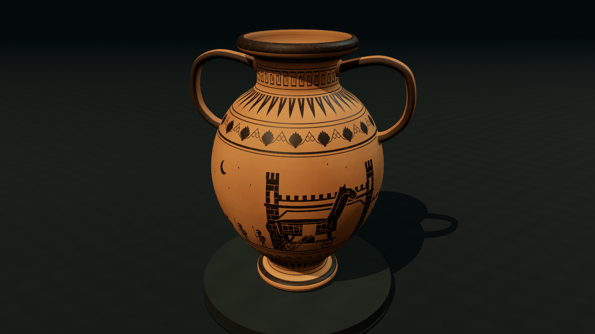
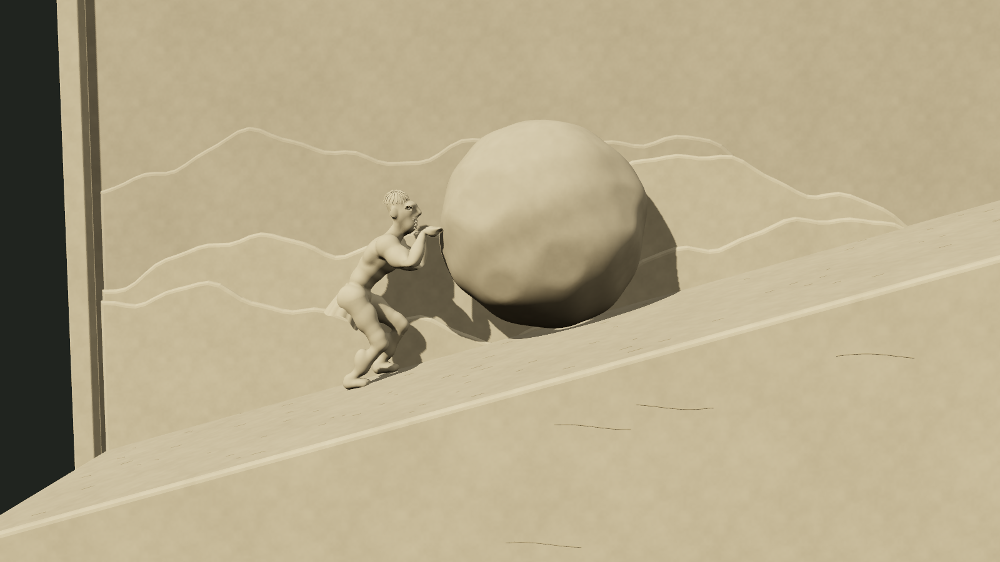
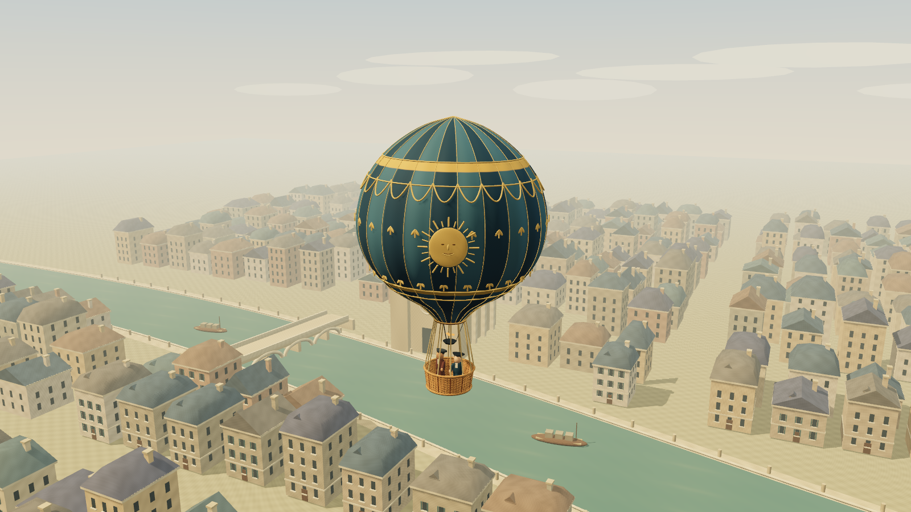
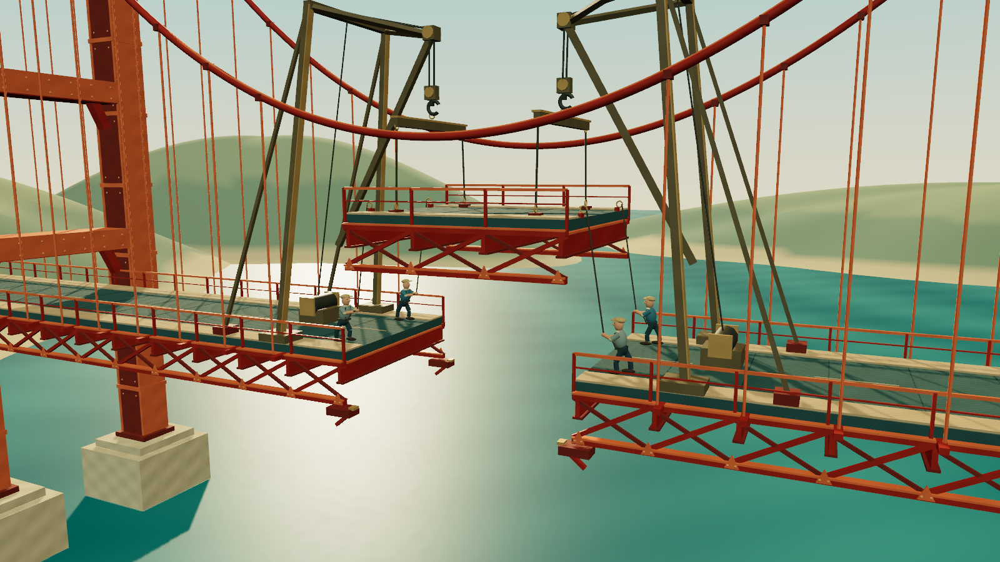
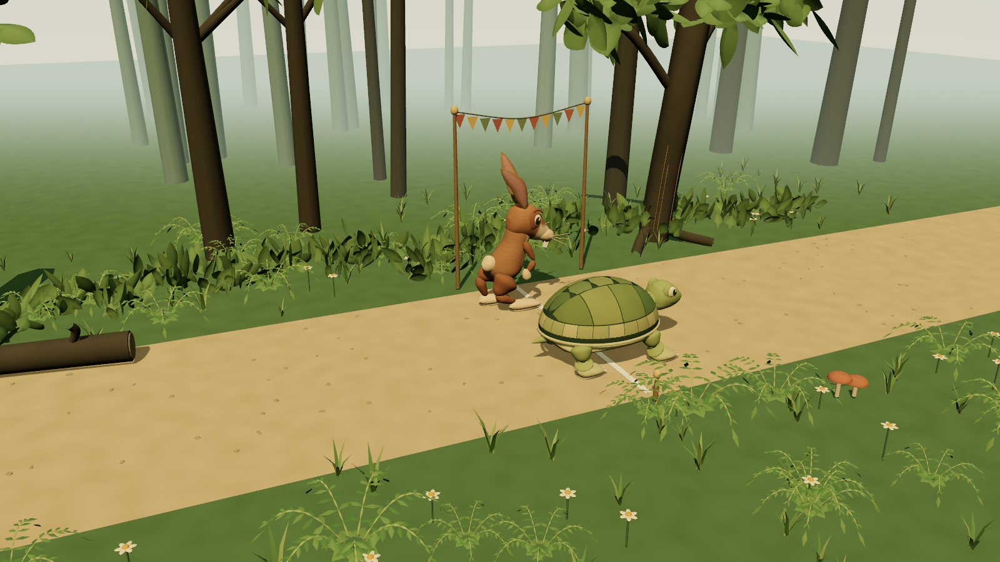

# Astra - Refined Animation Collection

[Open the latest gallery](https://az9713.github.io/gpt-6-astra-builds/) · [Development guide](https://az9713.github.io/gpt-6-astra-builds/latest/development.html) · [Earlier Three.js collection](https://az9713.github.io/gpt-6-astra-builds/three.html) · [Canvas comparison](https://az9713.github.io/gpt-6-astra-builds/canvas.html)

Five original twenty-second animations, refined under the requested **Astra Extra High** configuration (`gpt-6-astra`, `xhigh`). The scenes use **Three.js 0.186.1 and TSL**, with WebGPU and WebGL 2 rendering. Sisyphus loops continuously; the other four hold their completed frame at twenty seconds. Reload to replay.

The [HTML development guide](https://az9713.github.io/gpt-6-astra-builds/latest/development.html) explains the Deskworlds investigation, the original code changes, matched comparisons and measured limits. A renderer supplies the tools; convincing results depend on subject-specific geometry, material, light and motion.

## 1. Troy, Written in Clay

A hollow ceramic vessel with shaped handles, fired clay and a moving black-figure story. Screenshot at 20 seconds.

[Play latest](https://az9713.github.io/gpt-6-astra-builds/latest/01-trojan-vase/index.html) · [Force WebGL 2](https://az9713.github.io/gpt-6-astra-builds/latest/01-trojan-vase/index.html?backend=webgl) · [Previous Three.js](https://az9713.github.io/gpt-6-astra-builds/three/01-trojan-vase/index.html) · [Canvas](https://az9713.github.io/gpt-6-astra-builds/01-trojan-vase/index.html)

## 2. Sisyphus, in Stone

A carved, connected figure pushes, steps aside, waits and follows the boulder in a separate lane. Screenshot at 0 seconds.

[Play latest](https://az9713.github.io/gpt-6-astra-builds/latest/02-sisyphus-relief/index.html) · [Force WebGL 2](https://az9713.github.io/gpt-6-astra-builds/latest/02-sisyphus-relief/index.html?backend=webgl) · [Previous Three.js](https://az9713.github.io/gpt-6-astra-builds/three/02-sisyphus-relief/index.html) · [Canvas](https://az9713.github.io/gpt-6-astra-builds/02-sisyphus-relief/index.html)

## 3. Above Paris

A sewn envelope, woven basket and attached ropes rise above a cheering crowd and varied city. Screenshot at 12 seconds.

[Play latest](https://az9713.github.io/gpt-6-astra-builds/latest/03-paris-balloon/index.html) · [Force WebGL 2](https://az9713.github.io/gpt-6-astra-builds/latest/03-paris-balloon/index.html?backend=webgl) · [Previous Three.js](https://az9713.github.io/gpt-6-astra-builds/three/03-paris-balloon/index.html) · [Canvas](https://az9713.github.io/gpt-6-astra-builds/03-paris-balloon/index.html)

## 4. Joining the Golden Gate

A riveted steel section descends on attached lifting gear while workers guide it onto bearings. Screenshot at 0 seconds.

[Play latest](https://az9713.github.io/gpt-6-astra-builds/latest/04-golden-gate/index.html) · [Force WebGL 2](https://az9713.github.io/gpt-6-astra-builds/latest/04-golden-gate/index.html?backend=webgl) · [Previous Three.js](https://az9713.github.io/gpt-6-astra-builds/three/04-golden-gate/index.html) · [Canvas](https://az9713.github.io/gpt-6-astra-builds/04-golden-gate/index.html)

## 5. Slowly Wins the Day

A scuted tortoise and an expressive hare race through layered woodland on planted feet. Screenshot at 20 seconds.

[Play latest](https://az9713.github.io/gpt-6-astra-builds/latest/05-tortoise-hare/index.html) · [Force WebGL 2](https://az9713.github.io/gpt-6-astra-builds/latest/05-tortoise-hare/index.html?backend=webgl) · [Previous Three.js](https://az9713.github.io/gpt-6-astra-builds/three/05-tortoise-hare/index.html) · [Canvas](https://az9713.github.io/gpt-6-astra-builds/05-tortoise-hare/index.html)

## Attribution and scope

Prompt source: **Arena AI**, [the source video beginning at 28:09](https://www.youtube.com/watch?v=r0ymhRtcTeI&t=1689s). This attribution was supplied by the project owner; the video was not independently reviewed. No video frames or artwork are included.

The inspection of a local Deskworlds Windows port informed general lessons about form, surface, lighting and coherent movement. No Deskworlds code or art was copied. All artwork here is original procedural geometry or generated texture data. The vase draws its own CanvasTexture pigment mask; Sisyphus includes a baked original sculpture mesh. Three.js is the only third-party runtime dependency and is included with its MIT license. Animations load no remote libraries, images, models, fonts or SVG.

These are authored animations and period-inspired illustrations. Exact decoration, geography, equipment and historical construction sequence were not independently verified under the original no-research constraint. The requested model configuration records the request, not an independently audited model identity.

## Running and validation

Serve the repository over HTTP, for example with `python -m http.server 8000`, then open `http://localhost:8000/`. No installation or build is required. The Three.js pages use local ES modules and need HTTP; the preserved Canvas pages also work as standalone HTML. Portrait screens preserve the landscape composition without scene controls.

`python scripts/verify.py` checks the explicit publication allowlist, pinned runtime/art hashes, unchanged earlier scenes, local links and imports, clean image metadata, privacy patterns and gallery destinations. The development guide reports browser measurements and contact tests with their limits. Desktop and portrait viewport checks use one laptop GPU; they are not physical-phone benchmarks or universal frame-rate guarantees.

The Pages workflow verifies and deploys an explicit site tree using actions pinned to exact revisions. The live `revision.txt` identifies the deployed Git commit. Previous Astra Three.js files remain under `three/`; Canvas files retain their original numbered URLs. Private work notes and unrelated generations are excluded.
