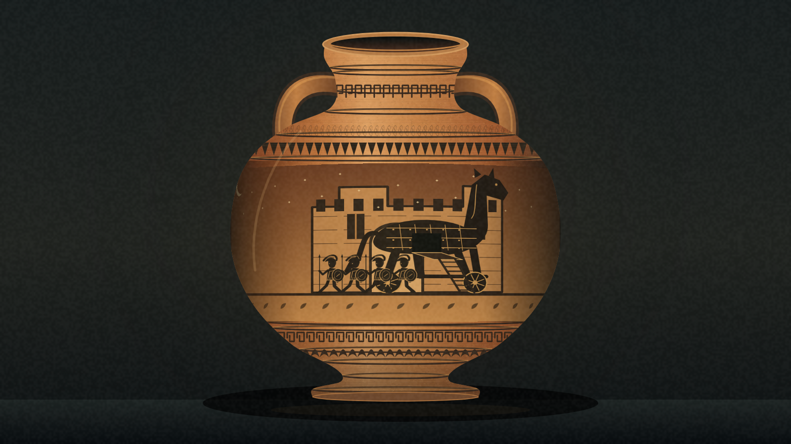
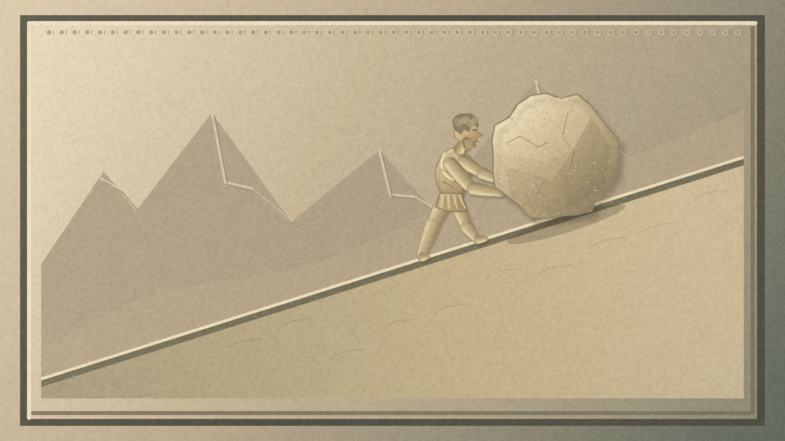
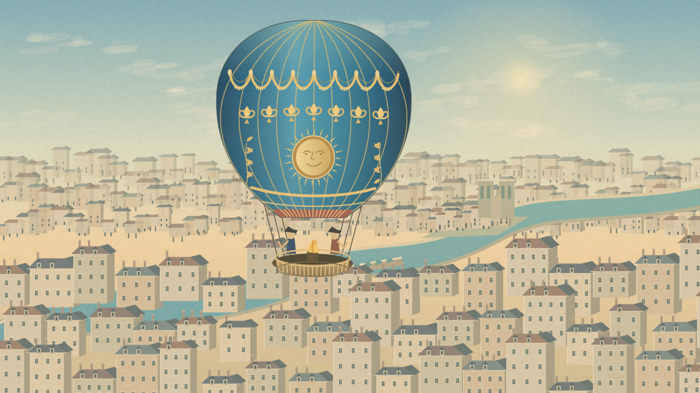
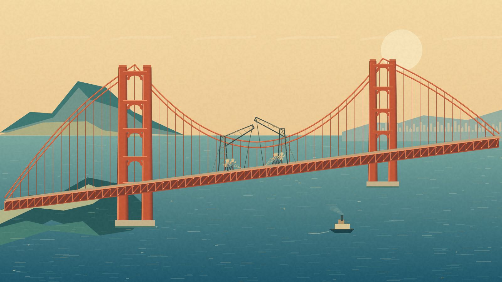
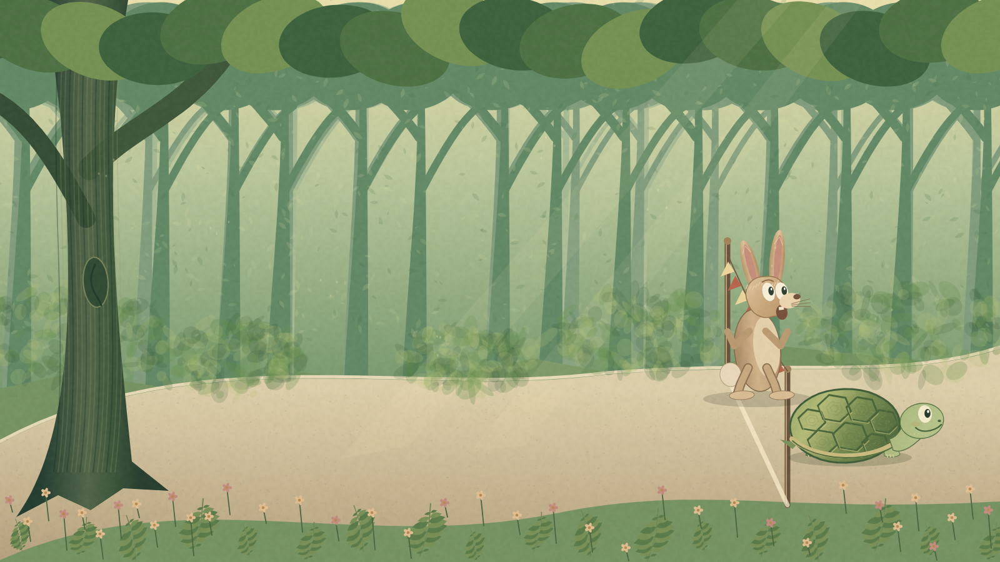

# Astra — Canvas Studies

Five original, twenty-second animations made with vanilla JavaScript and Canvas 2D.

**[Open the live gallery](https://az9713.github.io/gpt-6-astra-builds/)** · Click a screenshot below to open that animation directly on GitHub Pages. GitHub README previews are still images; animation plays on the linked page.

## 1. Troy, Written in Clay

A rotating terracotta vase tells the story of the Trojan horse. Screenshot captured at 20 seconds. [Play animation](https://az9713.github.io/gpt-6-astra-builds/01-trojan-vase/index.html).

## 2. Sisyphus, in Stone

A carved stone figure pushes, loses, and begins again. Screenshot captured at 0 seconds. [Play animation](https://az9713.github.io/gpt-6-astra-builds/02-sisyphus-relief/index.html).

## 3. Above Paris

An ornate balloon climbs above an eighteenth-century city. Screenshot captured at 11 seconds. [Play animation](https://az9713.github.io/gpt-6-astra-builds/03-paris-balloon/index.html).

## 4. Joining the Golden Gate

A roadway section settles into place before the bay is revealed. Screenshot captured at 20 seconds. [Play animation](https://az9713.github.io/gpt-6-astra-builds/04-golden-gate/index.html).

## 5. Slowly Wins the Day

A sleeping hare wakes just too late in a woodland race. Screenshot captured at 20 seconds. [Play animation](https://az9713.github.io/gpt-6-astra-builds/05-tortoise-hare/index.html).

## Prompt credit

The prompt source is **Arena AI**, in [this video starting at 28:09](https://www.youtube.com/watch?v=r0ymhRtcTeI&t=1689s). The scenes are original code-based interpretations of those prompts. This credit and link were supplied by the project owner; the video was not independently reviewed during creation. No video frames or other external artwork are included.

## Generation provenance

This collection was freshly authored in the generation explicitly requested as **Astra Extra High**, using the delegated configuration **`gpt-6-astra` with `xhigh` reasoning effort**. This records the requested execution configuration, not an independently audited model identity. Only that generation is included in this repository.

## Playback and implementation

- Open any numbered folder’s `index.html` directly in a browser, or use the live links above. There is no build step, package installation, or local server requirement.
- Each animation is self-contained: one HTML file with original Canvas drawing code, no libraries, SVG, remote resources, fonts, or imported assets. The screenshot gallery is separate from the animations.
- Playback starts automatically and lasts twenty seconds. Sisyphus loops seamlessly; the other scenes hold their final frame. Reload a page to replay it.
- The landscape artwork fits the viewport without scrolling and is letterboxed on portrait screens. There are no controls inside the animation pages.
- Screenshots are actual 1600 × 900 browser captures of the exact animation files committed here.

## Historical interpretation

The balloon scene depicts the first untethered human balloon-flight theme above eighteenth-century Paris. The bridge is the Golden Gate Bridge. These are period-inspired illustrations, not archival reconstructions. Under the original no-research constraint, precise balloon decoration, Paris geography, construction equipment, and the bridge’s construction sequence were not independently verified; strict historical accuracy is not claimed.

## Verification and deployment

Run `python scripts/verify.py` for the publication allowlist, source-integrity, standalone-page, screenshot-metadata, privacy-pattern, and link checks. It uses the Python standard library only.

The Pages workflow runs those checks and deploys only the gallery, five animations, five screenshots, and a revision marker. `revision.txt` on the live site identifies the deployed Git commit. The workflow actions are pinned to exact upstream revisions.
