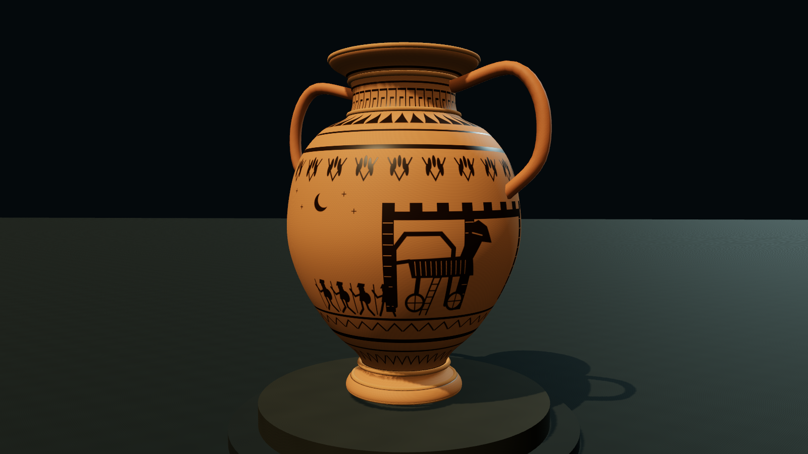
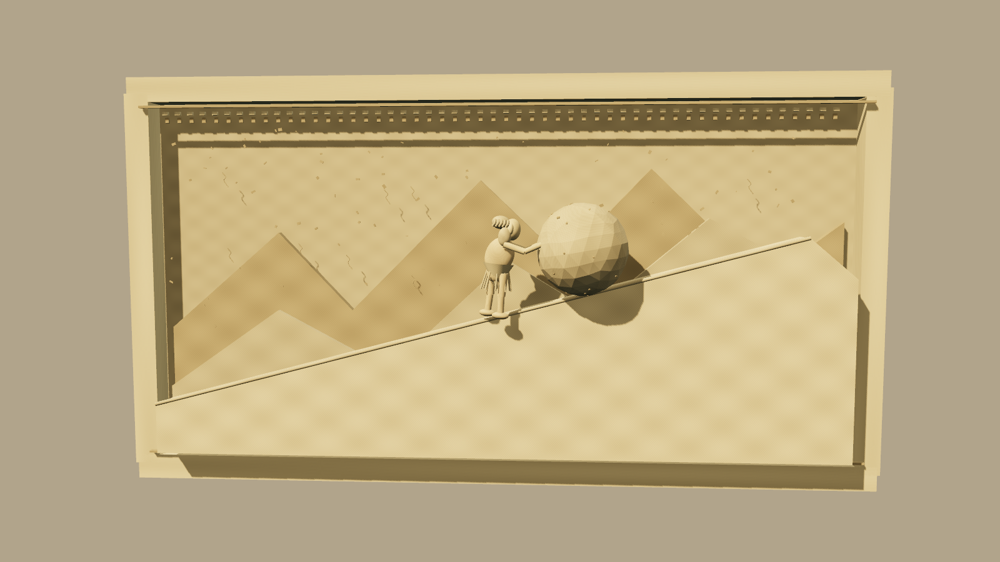
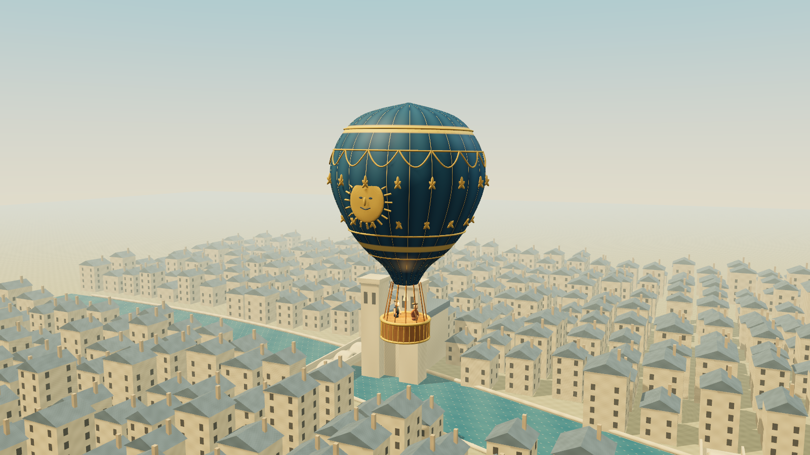
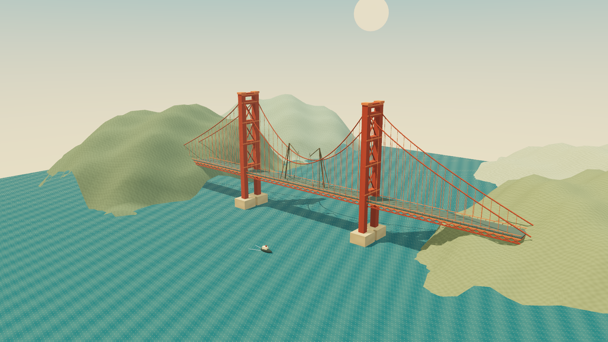
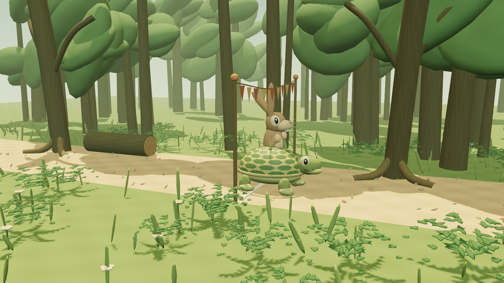

# Astra — Three.js + TSL Studies

Five original twenty-second procedural 3D animations, built with **Three.js 0.186.1** and **Three Shading Language (TSL)**.

**[Open the live Generation 3 gallery](https://az9713.github.io/gpt-6-astra-builds/)** · **[Compare the earlier Canvas collection](https://az9713.github.io/gpt-6-astra-builds/canvas.html)**

Click a screenshot to play its animation on GitHub Pages. GitHub READMEs display still images; they do not execute the animation inline.

## 1. Troy, Written in Clay

A rotating 3D vessel with a living pigment mask and TSL terracotta glaze. Screenshot captured at 20 seconds.

[Play Generation 3](https://az9713.github.io/gpt-6-astra-builds/three/01-trojan-vase/index.html) · [Force WebGL 2](https://az9713.github.io/gpt-6-astra-builds/three/01-trojan-vase/index.html?backend=webgl) · [Compare Canvas](https://az9713.github.io/gpt-6-astra-builds/01-trojan-vase/index.html)

## 2. Sisyphus, in Stone

Articulated sculpture, a rolling boulder and procedural limestone in a seamless loop. Screenshot captured at 0 seconds.

[Play Generation 3](https://az9713.github.io/gpt-6-astra-builds/three/02-sisyphus-relief/index.html) · [Force WebGL 2](https://az9713.github.io/gpt-6-astra-builds/three/02-sisyphus-relief/index.html?backend=webgl) · [Compare Canvas](https://az9713.github.io/gpt-6-astra-builds/02-sisyphus-relief/index.html)

## 3. Above Paris

Woven silk and raised gold ornament rise above a procedural city and river. Screenshot captured at 12 seconds.

[Play Generation 3](https://az9713.github.io/gpt-6-astra-builds/three/03-paris-balloon/index.html) · [Force WebGL 2](https://az9713.github.io/gpt-6-astra-builds/three/03-paris-balloon/index.html?backend=webgl) · [Compare Canvas](https://az9713.github.io/gpt-6-astra-builds/03-paris-balloon/index.html)

## 4. Joining the Golden Gate

Workers guide suspended steelwork above a bay with shader-driven waves. Screenshot captured at 20 seconds.

[Play Generation 3](https://az9713.github.io/gpt-6-astra-builds/three/04-golden-gate/index.html) · [Force WebGL 2](https://az9713.github.io/gpt-6-astra-builds/three/04-golden-gate/index.html?backend=webgl) · [Compare Canvas](https://az9713.github.io/gpt-6-astra-builds/04-golden-gate/index.html)

## 5. Slowly Wins the Day

Expressive 3D characters race through a woodland of procedural trees and ferns. Screenshot captured at 20 seconds.

[Play Generation 3](https://az9713.github.io/gpt-6-astra-builds/three/05-tortoise-hare/index.html) · [Force WebGL 2](https://az9713.github.io/gpt-6-astra-builds/three/05-tortoise-hare/index.html?backend=webgl) · [Compare Canvas](https://az9713.github.io/gpt-6-astra-builds/05-tortoise-hare/index.html)

## Prompt credit

The prompt source is **Arena AI**, in [the source video starting at 28:09](https://www.youtube.com/watch?v=r0ymhRtcTeI&t=1689s). This attribution and link were supplied by the project owner; the video was not independently reviewed. No frames or artwork from the video are included.

## Generation provenance

Generation 3 was explicitly requested as **Astra Extra High**, using the delegated configuration **`gpt-6-astra` with `xhigh` reasoning effort**. This records the requested configuration, not an independently audited model identity. The earlier Astra Canvas generation remains available at its original numbered URLs and through `canvas.html`.

## Rendering and dependencies

- The five scenes use real Three.js geometry, lighting, cameras and character animation. TSL drives clay pigment and glaze, stone texture, silk and gold panels, water displacement and shading, shell patterns and other procedural materials.
- The vase uses a newly drawn procedural CanvasTexture as the pigment mask on its 3D surface. It does not reuse frames from the Canvas generation.
- The pinned Three.js runtime is vendored under `three/vendor/`, with its [MIT license](three/vendor/LICENSE). It is the only third-party runtime dependency. No remote CDNs, artistic assets, models, images, fonts, SVG markup or other libraries are loaded by an animation.
- `WebGPURenderer` selects WebGPU when available and supports WebGL 2 fallback while compiling TSL for either backend. Add `?backend=webgl` to force that backend. There is no Canvas fallback inside Generation 3; use the comparison collection if needed.
- Each animation starts automatically. Sisyphus loops seamlessly; the others hold their frame at twenty seconds. Reload to replay. Portrait layouts are letterboxed, with no website controls inside the scenes.

## Running locally

Serve the repository over HTTP, for example with `python -m http.server 8000`, then open `http://localhost:8000/`. No npm installation or build step is needed. Generation 3 relies on ES modules and shared local files, so opening its HTML directly with a `file:` URL is not supported. The preserved Canvas pages still work as standalone HTML.

## Historical interpretation

The balloon interprets the first untethered human flight above eighteenth-century Paris, and the bridge is the Golden Gate Bridge. These are period-inspired illustrations, not archival reconstructions. Exact decoration, geography, construction equipment and construction sequence were not independently verified under the original no-research constraint.

## Validation and deployment

`python scripts/verify.py` checks the publication allowlist, preserved Canvas files, pinned Three.js and scene hashes, local imports, screenshot metadata, privacy patterns and both galleries’ destinations. It uses only the Python standard library.

The Pages workflow runs those checks and deploys an explicit site allowlist. The live `revision.txt` identifies the exact deployed Git commit. Workflow actions are pinned to exact upstream revisions. Browser verification covers the two renderer backends, full timelines, the Sisyphus loop, mobile layouts and external requests.
